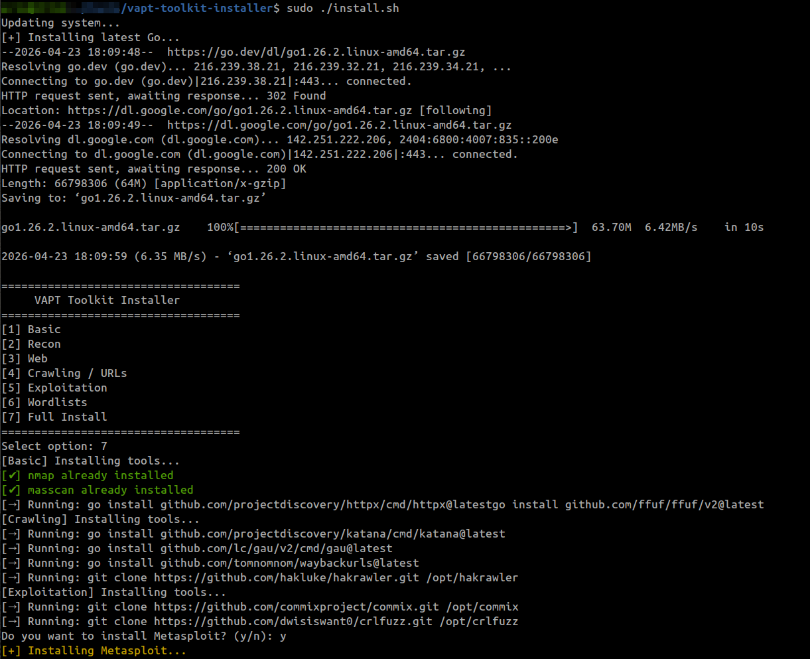
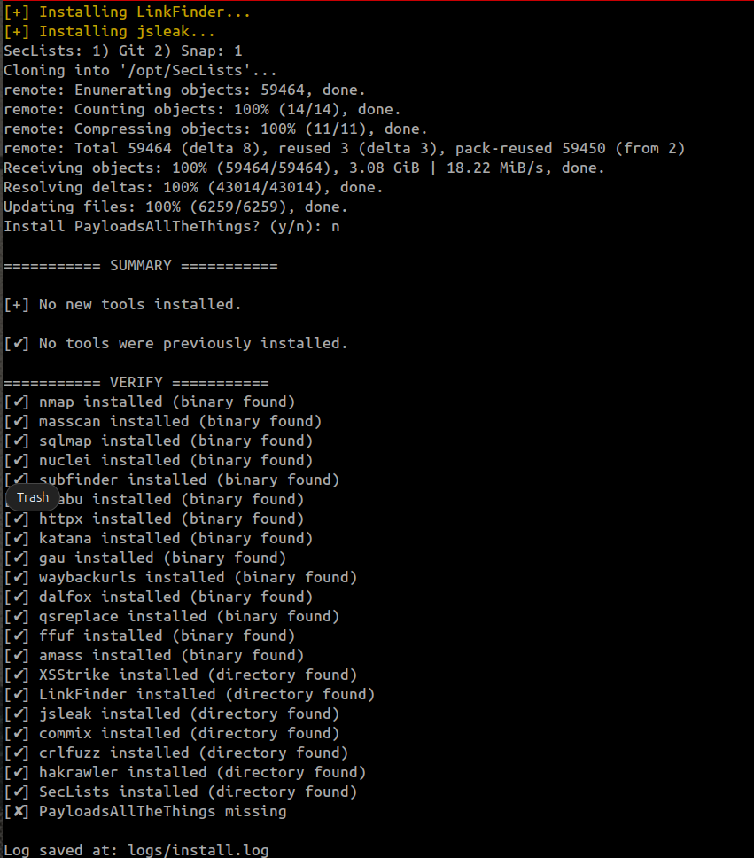
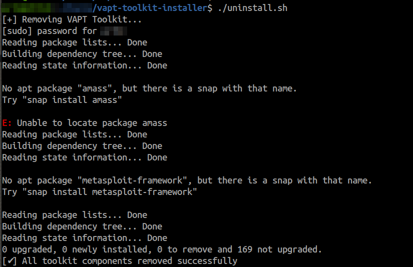

# 🛠️ VAPT Toolkit Installer

> A modular, high-performance installer for setting up a complete **Vulnerability Assessment & Penetration Testing (VAPT)** environment in minutes.

---

## 🚀 Overview

**VAPT Toolkit Installer** automates the installation of essential penetration testing tools using a clean, category-based approach.
Built for **security professionals, bug bounty hunters, and researchers**, it provides flexibility, speed, and reliability.

---

## ✨ Features

* ⚡ **Parallel Installation** – Faster setup using controlled concurrency
* 🧩 **Modular Categories** – Install only what you need
* 🤖 **Silent Mode** – Fully automated installation
* 🔄 **Update Mode** – Update all tools to latest versions
* 🧠 **Smart Detection** – Skips already installed tools
* 📊 **Tool Verification** – Final status report after install
* 📝 **Logging** – Detailed logs saved for debugging
* 🧹 **Uninstall Support** – Clean removal of installed tools

---

## 📦 Installation

```bash
git clone https://github.com/wintgod/vapt-toolkit-installer.git
cd vapt-toolkit-installer
chmod +x install.sh scripts/*.sh
sudo ./install.sh
```

---

## 📂 Installed Tool List

 ### 🔍 Recon & Enumeration
- Nmap
- Masscan
- Subfinder
- Amass
- Naabu
- httpx

---

### 🌐 Web Application Testing
- Nuclei
- SQLMap
- Dalfox
- XSStrike
- GF
- qsreplace
- ffuf
- unfurl

---

### 🕷 Crawling / URL Discovery
- Katana
- hakrawler
- gau
- waybackurls

---

### 📁 JavaScript / Endpoint Discovery
- LinkFinder
- jsleak

---

### 💣 Exploitation
- Commix
- crlfuzz
- Metasploit Framework *(optional)*

---

### 📚 Wordlists / Payloads
- SecLists
- PayloadsAllTheThings *(optional)*

---

## 📸 Installation Screenshots

### Installation Process


---

### Installation Completion


---

## 🧹 Uninstallation

```bash
cd vapt-toolkit-installer
chmod +x uninstall.sh 
sudo ./uninstall.sh
```

---

## 📸 Uninstallation Screenshots

### Uninstallation Process


---

## ⚙️ Usage Modes

### 🔹 Interactive Mode

```bash
sudo ./install.sh
```

### 🔹 Silent Mode (Full Install)

```bash
sudo ./install.sh --silent
```

### 🔹 Update Mode

```bash
sudo ./install.sh --update
```

---


